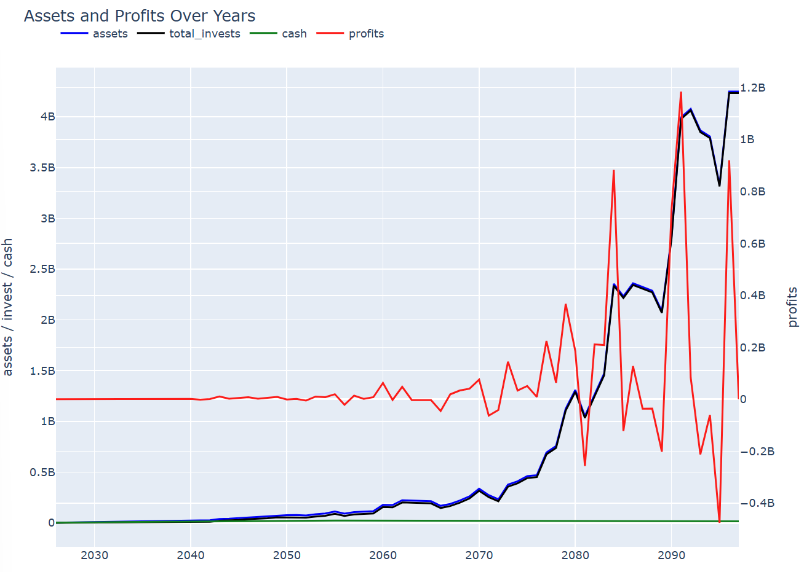
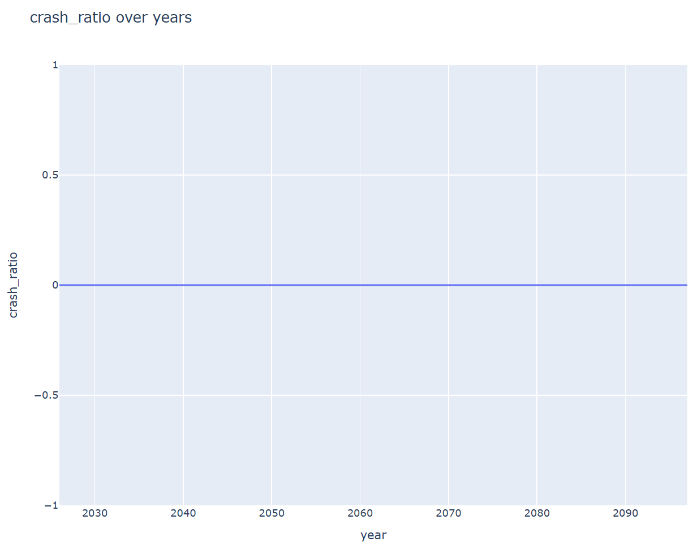
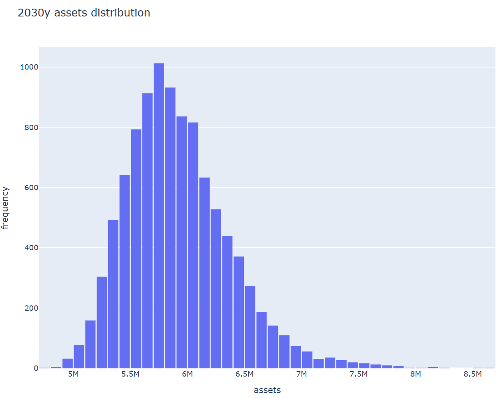
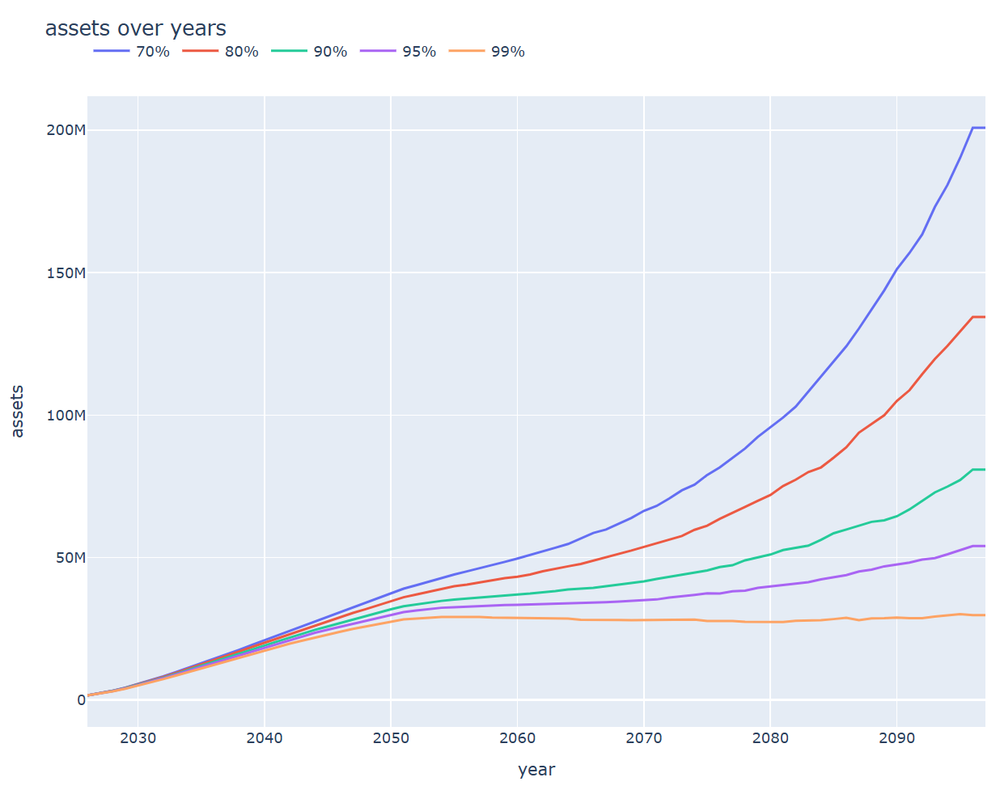

# asset_simulator
資産の推移を計算し、ライフプランの設計の助けとなるツールです。
# exeを実行して計算
# assetsim_main.exeのマニュアル
- example/simulator_setを任意の場所に保存
- asset_planを編集
    - 列の説明
        - ageより左の列  
            - databaseに格納した年間利回り分布データにある名前を記載  
                - 最初から使える銘柄  
                    - BANK(年利0%)
                    - SP500
                    - NASDAQ
                    - Nikkei225
                    - DowJones
                    - DAX30INDEX
                    - Shanghai_Composite_Index

        - age : 年齢を記載
        - year : 西暦を記載
        - income : その年の想定収入を記載  
        - saving_per_year : 現金貯金額を記載  
        - invest_per_year : 年間投資額を記載
        - invest_per_yearよりも右の列  
            - 年間支出を記載  
            - 複数列を記載しても良い(invest_per_yearよりも右の列はすべて積算され、支出として扱う)
    - 編集に注意する列
        - 名前変更・位置関係変更禁止列  
            - age
            - year
            - income
            - saving_per_year
            - invest_per_year
- assetsim_main.exeクリックし実行(テスト)  
    - デフォルトの条件で計算開始
    - resultフォルダに結果が格納される。
    - condition.jsonに計算条件が出力される
- 計算条件を変更
    - condition.jsonを開き編集
        ```
        {
            "output_dir": "<simulator_setのパス>/result",
            "asset_plan_in": "<simulator_setのパス>/asset_plan.csv",
            "sock_database_path": "<simulator_setのパス>/database",
            "fig_mode": "matplotlib",#matplotlib(容量少ない) or plotly(見やすい)
            "is_show": false,# 編集不要
            "single_life_mode": true,
            "initial_year": 2025,# 最初の年
            "initial_cash": 2500000,# 初期現金
            "initial_invest_asset": 0, # 初期投資資産
            "multi_life_mode": true, # 編集不要
            "number_of_life": 1000,# 計算するライフ数(多いほど精度向上) 推奨=10000
            "check_years": [
                2026,
                2030,
                2040,
                2050,
                2060,
                2070,
                2080,
                2090
            ],# 各年における資産の分布
            "asset_threshold": 50000000,# 達成確率を計算する金額
            "achieve_percents": [
                70,
                80,
                90,
                95,
                99
            ]# 描画する達成確率(各凡例の確率で資産推移以上になる)
        }
        ```
- 結果の見方
    - one_life_asset.html:ある一回の資産シミュレーションの結果  
          
          
        - assets:総資産  
        - total_invests:総投資資産  
        - total_invests:総現金  
        - total_invests:その年の利益額  
    - achive_ratio_*.html:指定金額を資産が超える確率の推移  
        以下の図では2040年に2000万円を超える確率が80%であることがわかる  
          
    - crash_ratio.html:総金融資産が0円を下回る確率の推移  
        クラッシュ率は常に0%であることがわかる。  
          
    - check_plan.html:asset_planの読み込み結果  
          
        - income : 収入推移  
        - outcome : 支出推移  
        - saving_per_year : 年間現金貯金額  
        - invest_per_year : 年間投資額  
    - asset_distribution_in_XXXXy.html:XXXX年の資産分布  
        モンテカルロ法で投資の資産推移を計算しているため分布が生じる  
          
    - asset_transition_70_80_90_95_99.html:70~99%の確率で想定される資産推移  
        99%の確率で100歳まで資産が減らないことを示唆している。  
          

- 計算の詳細
    - 投資によるリターンの計算  
        - databaseに格納された各種商品の年間利回り分布に従い乱数で次の年の利率を計算  
        - その年の投資資産に年利をかけて次の年の投資資産を算出
    - 収支計算(income,saving_per_year,invest_per_year,outcomeの扱い)  
        - 概要
            - 上記の投資資産の変化を計算した後収支計算を行う。
            - その年の収支を計算(income-outcome)
                - 黒字の場合  
                    - saving_per_year分cashを増やし、増分を黒字額から引く
                    - invest_per_year分投資額を増やし、増分を黒字額から引く  
                    - 貯金と投資を終えても黒字に余りがある場合はcashに追加
                - 赤字の場合
                    - cashから赤字額を引く
                    - cashが0になったら投資額から赤字額を引く
        - 詳細
            - asset_src/assetsim.pyのupdate_assets_one_yearを参照
    - 複数投資の場合
        - asset_plan.csvの銘柄欄の数字を調整
            投資資産の50%をSP500,25%を銀行,25%を日経とする場合  
              
# databaseの説明
# python環境で計算
